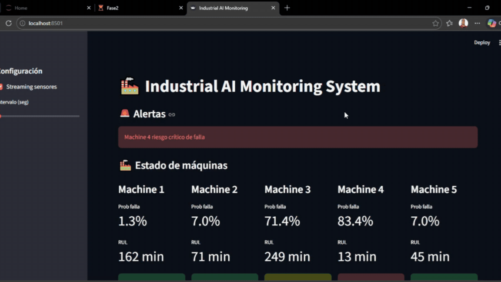
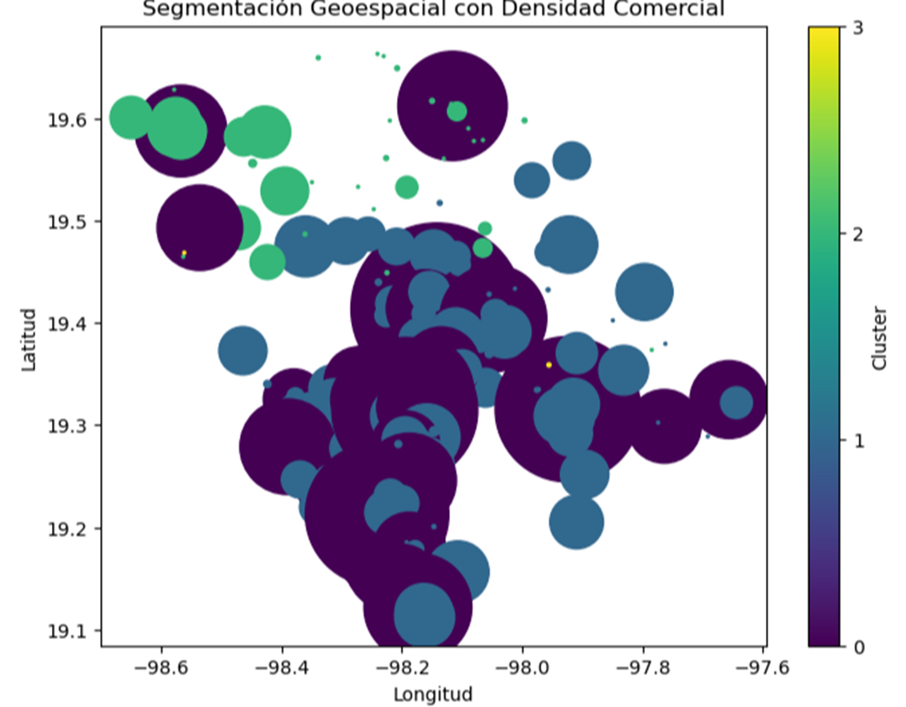

<h1 align="center">Hola, soy Rodolfo Japa </h1>

  

---

 
	 

## <picture></picture> Sobre mí

<picture> 
	
</picture>

- 📊 Soy un **Data sciencie** apasionado por la **toma de decisiones basada en datos**.  
- 🛠 Con experiencia en **Excel, SQL, Power BI, Tableau, Python, R y Estadística**.  
- 📈 Experiencia en **Limpieza de Datos, Visualización, Pronósticos y Análisis de Mercado**.  
- 📊 Desarrollo de **dashboards e indicadores (KPIs)** que apoyan decisiones estratégicas.  
- 🌱 Actualmente profundizando en **Analítica Predictiva y Machine Learning**.  
- 💼 Abierto a **nuevas oportunidades laborales** donde pueda aportar valor mediante el análisis de datos.  

---

## 🛠️ Mis Habilidades  

### 📊 Herramientas de Analítica de Datos  

  
  
  
  
  
  
  

### 📈 Habilidades de Negocios y Analítica  
- Limpieza y Transformación de Datos  
- Visualización de Datos y Creación de Dashboards  
- Pronósticos y Análisis de Series Temporales  
- Segmentación de Clientes (RFM, Clustering)  
- Diseño de KPIs e Insights de Negocio  

---

## 📂 Proyectos Destacados  

🔹 **[Industrial AI Monitoring System – Monitoreo Predictivo de Fallas](https://github.com/RodolfoJapa/portafolio/tree/main/Dashboar_Pizzas)** Desarrollar un sistema de monitoreo industrial en Python para la predicción y prescripción de fallas en maquinaria utilizando datos de sensores y técnicas de Machine Learning.

🔹 **[Pizza Sales Dashboard – Análisis de Rendimiento Comercial](https://github.com/RodolfoJapa/portafolio/tree/main/Dashboar_Pizzas)** →El dashboard fue construido en Power BI para analizar el desempeño de ventas de una pizzería, permitiendo visualizar métricas clave del negocio como ingresos totales, volumen de pedidos, comportamiento de ventas a lo largo del tiempo y desempeño por categorías de pizza.

🔹 **[Dashboard de Ventas – Análisis de Rendimiento y Rentabilidad del Negocio](https://github.com/RodolfoJapa/portafolio/tree/main/Dashboard_Sales)** →Desarrollé un dashboard interactivo para analizar el rendimiento comercial y la rentabilidad del negocio. La solución incluye indicadores clave (KPIs) como ventas totales, ganancia total, margen de beneficio (27%), evolución mensual y diaria, análisis por producto, tipo de venta y método de pago.

🔹 **[Dashboard de Ingresos en Power BI para Análisis del Desempeño del Negocio](https://github.com/RodolfoJapa/portafolio/tree/main/Dashboard_Incomes)** Desarrollé un dashboard interactivo en Power BI para analizar el desempeño financiero de una clínica veterinaria. El proyecto se enfoca en transformar datos en información accionable mediante la visualización de ingresos totales, tendencias mensuales, ingresos por servicio, tipo de animal y rendimiento por doctor.

🔹 **[Detección de Anomalías con Kurtosis en Python](https://github.com/RodolfoJapa/portafolio/tree/main/ciencia%20de%20datos)** → Identifiqué comportamientos transaccionales atípicos utilizando kurtosis como métrica estadística, replicando un flujo de análisis de datos.

🔹 **[Detección de Anomalías con Kurtosis y Decision Trees en Python)](https://github.com/RodolfoJapa/portafolio/tree/main/machine_learnig_python)** → Construí un pipeline de machine learning para la detección de comportamientos anómalos, combinando ingeniería de características basada en kurtosis y un modelo de Decision Tree en un entorno reproducible. Esta imagen representa la matriz de confusión del modelo Decision Tree entrenado dentro de un pipeline de machine learning para la detección de comportamientos anómalos.

🔹 **[NumPy Data Science Project](https://github.com/RodolfoJapa/portafolio/tree/main/numpy)** → Implementé un flujo de trabajo de Data Science orientado a producción utilizando NumPy para procesamiento numérico eficiente y escalable.

🔹 **[Law of Large Numbers (LLN)](https://github.com/RodolfoJapa/portafolio/tree/main/probabilidad_python)** → Demostré la convergencia de la media muestral al valor esperado mediante simulaciones estadísticas, evidenciando cómo el aumento en el número de observaciones reduce la variabilidad y valida un principio fundamental de la probabilidad utilizado en Data Science y Machine Learning.

🔹 **[Data Science Project – Geospatial Clustering Analysis](https://github.com/RodolfoJapa/portafolio/tree/main/analisis_geopacial)** → Desarrollar un análisis de segmentación geoespacial utilizando Python para identificar patrones de distribución comercial en diferentes zonas geográficas.

  

## 🤝 Conecta Conmigo  

  
	

  
  

---

✨ *"Los datos son el nuevo petróleo, pero los insights son el verdadero combustible para el crecimiento de los negocios."*
